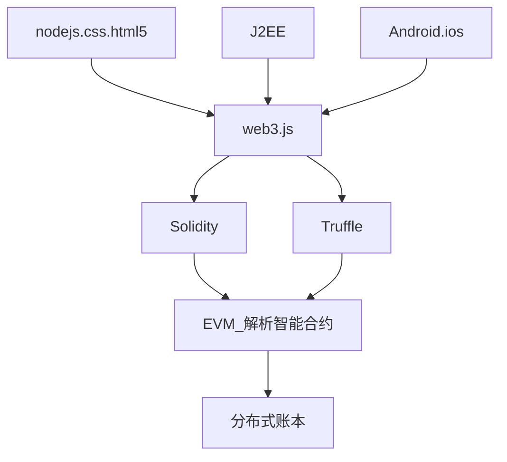

[TOC]

# 以太坊

## 以太坊

###### 以太坊特点

1. 官方语言Solidity图灵完备
2. 点对点协议
3. 每个网络及诶单都可以安装以太坊虚拟机执行智能合约
4. 没有用户预设操作，允许用户创建复杂的分布式应用

###### 与普通程序的区别

1. 去中心话，以信任为基础
2. 运行智能合约需要费用

###### 合约

合约的调用、创建，都默认为交易。每个合约都有地址，是后面调用的凭证。

###### ETH Wallet

以太坊客户端，即合约运行环境，可以管理、挖矿、转账、智能合约部署及执行

###### DAPP (Decentralized application)

DApp是可以让“终端to终端，终端to资源，资源to资源”在没有中间人的情况下直接进行互动、商定协议或通讯的app

###### Ether

以太币是在以太坊中使用的货币，以太币被用于支付在EVM中进行计算所需的开销Gas

###### 联盟链

IBM fabric

###### 业界项目结构关系图



###### 以太坊单位与Gas

> 一个数字后面跟随着一个后缀wei,finney,szabo或者ether,这个后缀就是货币单位.
> 不同的货币单位可以转换,不含任何后缀的默认单位是wei.以太币单位其实是密码
> 学家的名字.

###### Gas介绍与计算 

区块GasLimit: 区块gas limit是单个区块允许的最多gas总量，以此可以用来决定单个 区块中能打包多少笔交易。例如，我们有5笔交易的gas分别是10、20、30、40 和50.如果区块gas limit是100，那么前4笔交易就能被成功打包进入这个区块 


#### Solidity

账本写入成本高。类型长度谨慎使用。 

```
pragma solidity ^0.4.24;
contract IntDemo{
    // 主要演示 int,uint 相关特性，如果没有指定步长默认是 int --> int256
    function demo01() returns (int,uint,int){
        int8 num = 127; //8位，最高位符号位
        uint8 num2 = 255; //1个字节8位， 0~255
        var num3 = num; //与JS相同变量类型取决赋值的数据类型，初始化之后类型不能改变
        return(num,num3,num3)
    }
}
```


end

